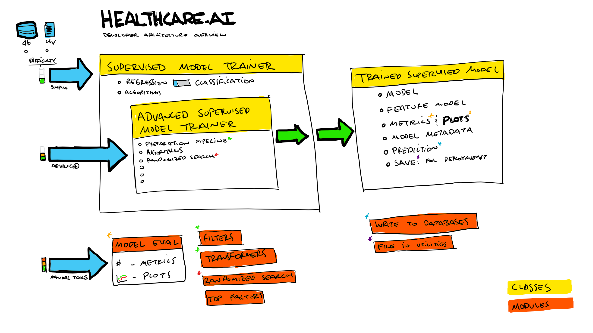

# Architecture Overview For Developers

This toolset can be used by three main types of users, in order of increasing sophistication.

## Core Classes

### SupervisedModelTrainer

- This is the simplest class to use that wraps the advanced class.
- It provides lots of console output by default and has reasonable default hyperparameters that cannot be overriden.

### AdvancedSupervisedModelTrainer

- This is the advanced class that provides no data preparation on instantiation.
- It provides minimal console output by default and has reasonable default hyperparameters that can be overriden.
- Custom ensemble methods are simple to implement.

### TrainedSupervisedModel

- This is the object that each Trainer class returns.
- It contains:
    + model metadata
    + model metrics
    + feature model
    + plots
    + PR/ROC metrics
    + save methods

## User Types

### 1. Beginners

Beginners should use `SupervisedModelTrainer`, which abstracts away most of the challenging parts of training machine learning models. By instantiating a trainer, the users's data is cleaned and prepared.

### 2. Advanced

Advanced users may want to use different data preparation pipelines, so they should use `AdvancedSupervisedModelTrainer`, which does not modify your data. See the [example_advanced.py]() script.

### 3. Experts

There is a small segment of our users that want to leverage some of the helper methods, data pipeline chunks and other utilities without directly using either of the `Trainer` classes.
