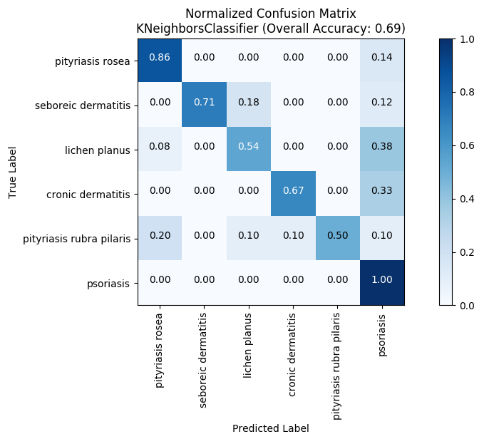
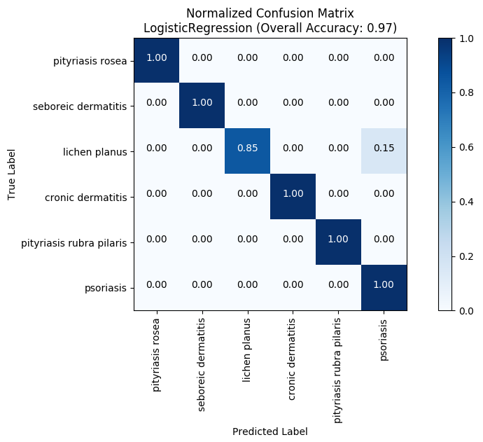
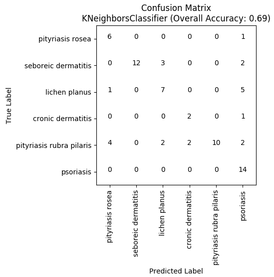
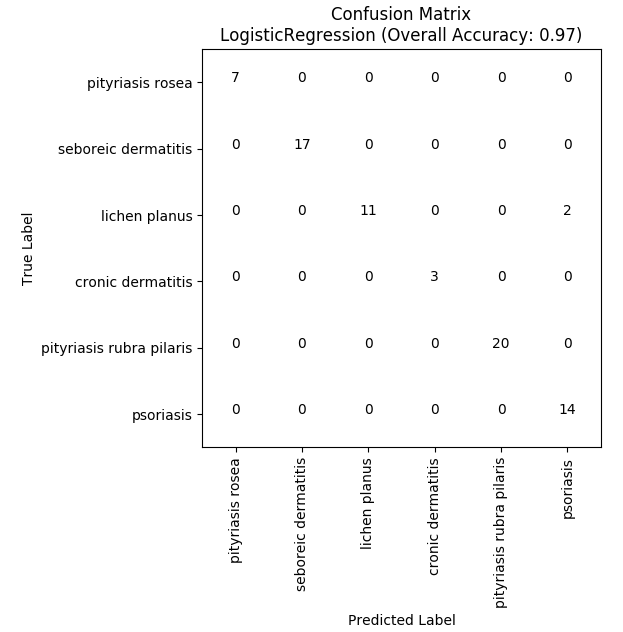

# Multi-Label Classification

Mulit-Label (aka multi-class) classification is where you have more than two categories to predict. For example, you may want to predict which of six types of skin disorder a patient has.

## Step 1: Load Sample Training Data

This dataset has 34 attributes and six categories of diagnosis.

```python
import healthcareai

dataframe = healthcareai.load_dermatology()

# Drop columns that won't help machine learning
dataframe.drop(['target_num'], axis=1, inplace=True)

# Peek at the dataset
print(dataframe.head())
```


## Step 2: Set up a Trainer

The `SupervisedModelTrainer` class helps you train models. It cleans and prepares the data before model creation. It also assignes parameters specific to the type of model you eventually want (regression or classification). To set up a trainer you'll need these arguments:

- **dataframe** *(pandas.core.frame.DataFrame)*: The training data in a pandas dataframe
- **predicted_column** *(str)*: The name of the prediction column 
- **model_type** *(str)*: the trainer type - 'classification' or 'regression'
- **impute** *(bool)*: True to impute data (mean of numeric columns and mode of categorical ones). False to drop rows
    that contain any null values.
- **grain_column** *(str)*: The name of the grain column
- **verbose** *(bool)*: Set to true for verbose output. Defaults to False.

### Example code

```python
# Setup a classification trainer. This prepares your data for model building
classification_trainer = healthcareai.SupervisedModelTrainer(
    dataframe,
    predicted_column='target_str',
    model_type='classification',
    grain_column='PatientID',
    impute=True)
```

## Step 3: Train some models

Now that you have a trainer set up, let's train some models!

### Example code

```python
# Train a KNN model
trained_knn = classification_trainer.knn()

# Train a logistic regression model
trained_lr = classification_trainer.logistic_regression()

# Train a random forest model and view the feature importance plot
trained_random_forest = classification_trainer.random_forest(save_plot=False)
```

## Step 4: Evaluate and Compare Models

Now that you have trained some models, let's evaluate and compare them.

#### Text Output

Each trained model has metrics that can be easily viewed by using the `.metrics` property. The best way to evaluate multilabel classification models is by using a confusion matrix.

#### Example code

```python
# Print the confusion matrix
trained_knn.print_confusion_matrix()

# Plot the confusion matrix
trained_knn.confusion_matrix_plot()
```

##### Output

```bash
                            seboreic dermatitis    pityriasis rubra pilaris    psoriasis    cronic dermatitis    pityriasis rosea    lichen planus
------------------------  ---------------------  --------------------------  -----------  -------------------  ------------------  ---------------
seboreic dermatitis                           8                           0            1                    1                   2                3
pityriasis rubra pilaris                      0                           5            2                    0                   0                2
psoriasis                                     2                           0            4                    0                   0                8
cronic dermatitis                             0                           0            1                    2                   0                0
pityriasis rosea                              0                           0            1                    1                  18                0
lichen planus                                 2                           0            2                    2                   1                6
```

### Plots

Compare these two normalized confusion matrix plots. The second is much more accurate than the first. This shows up on the plot as a dark diagonal line, indicating that a large percentage of each true label was identified.

#### Example Code

```python
# Train a KNN model
trained_knn.confusion_matrix_plot()
trained_knn.confusion_matrix_plot(normalize=False)

# Train a logistic regression model
trained_lr = classification_trainer.logistic_regression()
trained_lr.confusion_matrix_plot()
trained_lr.confusion_matrix_plot(normalize=False)
```

##### Output




You can also plot a non-normalized confusion matrix using `.confusion_matrix_plot(normalized=False)`, (which is similar to the printed console output of `print_confusion_matrix()`)




## Full example code

```python
"""Creates and compares classification models using sample clinical data.

Please use this example to learn about healthcareai before moving on to the next example.

If you have not installed healthcare.ai, refer to the instructions here:
  http://healthcareai-py.readthedocs.io

To run this example:
  python3 example_multiclass.py

This code uses the included dermatology sample data set.
"""

import healthcareai
from healthcareai.common.file_io_utilities import save_object_as_pickle


def main():
    """Template script for using healthcareai to train a classification model."""
    # Load the included dermatology sample data that has 6 classes
    dataframe = healthcareai.load_dermatology()

    # Peek at the first 5 rows of data
    print(dataframe.head(5))

    # Drop columns that won't help machine learning
    dataframe.drop(['target_num'], axis=1, inplace=True)

    # Step 1: Setup a healthcareai classification trainer. This prepares your data for model building
    classification_trainer = healthcareai.SupervisedModelTrainer(
        dataframe,
        predicted_column='target_str',
        model_type='classification',
        grain_column='PatientID',
        impute=True)

    # Step 2: train some models and look at their confusion matrices

    # Train a KNN model
    trained_knn = classification_trainer.knn()
    trained_knn.print_confusion_matrix()
    trained_knn.confusion_matrix_plot()
    trained_knn.confusion_matrix_plot(normalize=False)

    # Train a logistic regression model
    trained_lr = classification_trainer.logistic_regression()
    trained_lr.print_confusion_matrix()
    trained_lr.confusion_matrix_plot()
    trained_lr.confusion_matrix_plot(normalize=False)

    # Train a random forest model and view the feature importance plot
    trained_random_forest = classification_trainer.random_forest(save_plot=False)
    trained_random_forest.print_confusion_matrix()
    trained_random_forest.confusion_matrix_plot()

    # Train an ensemble regression model
    trained_ensemble = classification_trainer.ensemble()
    trained_ensemble.confusion_matrix_plot()

if __name__ == "__main__":
    main()

```
